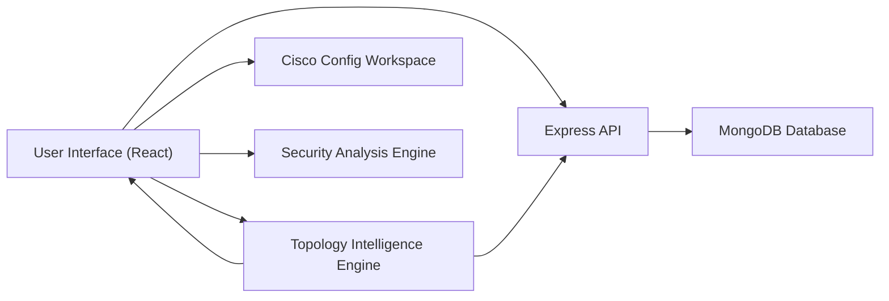

# NETFORGE Presentation Deck

## Professional Template Direction

- Theme: dark tech executive template
- Primary colors: deep navy `#07111f`, cyan `#22d3ee`, slate `#94a3b8`, white `#f8fafc`
- Accent color: emerald `#22c55e` for success metrics
- Font pairing:
  - Headings: `Montserrat SemiBold` or `Poppins SemiBold`
  - Body: `Aptos`, `Calibri`, or `Inter`
- Slide style:
  - clean title bar
  - large metric cards
  - minimal bullets
  - architecture diagrams on dark background
  - screenshots inside rounded cards

---

## Slide 1: Title Slide

**Title:**  
NETFORGE  
Intelligent Network Topology Automation Platform

**Subtitle:**  
Topology Generation, Cisco Configuration, Security Analysis, and MongoDB-Backed Management

**Presented by:**  
TEJA SADI

**Footer:**  
Domain / Final Project Presentation

**Speaker note:**  
This project focuses on automating network topology design and management while integrating configuration generation, security analysis, Cisco-oriented outputs, and MongoDB-backed persistence.

---

## Slide 2: Problem Statement

**Title:**  
Problem Statement

- Designing enterprise-style network topologies manually is time-consuming
- Beginners struggle with VLAN planning, IP addressing, and basic Cisco configuration
- Security validation is often done after deployment instead of during design
- Many student projects use static data and lack real database integration
- Existing tools rarely combine topology generation, analytics, security scoring, and device-ready config output in one platform

**Speaker note:**  
The main issue is fragmentation. Network planning, security checking, device configuration, and topology management usually happen across multiple tools instead of one intelligent system.

---

## Slide 3: Project Objectives

**Title:**  
Objectives

- Automatically generate structured topologies using routers, switches, PCs, and VLAN counts
- Produce basic router and switch configuration automatically
- Analyze topologies for segmentation and security weaknesses
- Maintain a real MongoDB-backed data layer for topologies and users
- Provide analytics dashboards for operational visibility
- Offer Cisco-focused configuration outputs for practical learning and lab use

**Speaker note:**  
The goal was not just to draw a network, but to build a complete intelligent workflow from generation to storage to security evaluation.

---

## Slide 4: Existing System Limitations

**Title:**  
Limitations of Existing Approach

- Static forms with limited automation
- No real persistence for user and topology data
- Mock dashboard statistics and department values
- No real user management
- No integrated Cisco command workspace
- No unified security scoring for topology design

**Speaker note:**  
Before enhancement, several sections depended on placeholder values or local-only storage, which reduced realism and scalability.

---

## Slide 5: Proposed System

**Title:**  
Proposed System

- Intelligent topology generator based on user-defined device counts
- Layered topology design:
  - core
  - distribution
  - access
- Automatic VLAN, IP, subnet, and gateway planning
- Cisco-style router and switch configuration generation
- Security analysis engine with scoring and suggestions
- MongoDB-backed user authentication, profiles, admin panel, and topology management

**Speaker note:**  
The proposed system transforms NETFORGE into a full-stack network automation platform rather than just a network drawing interface.

---

## Slide 6: System Architecture

**Title:**  
System Architecture

**Frontend**
- React
- TypeScript
- Tailwind CSS
- Recharts

**Backend**
- Node.js
- Express.js

**Database**
- MongoDB
- Mongoose

**Core Functional Engine**
- topology generator
- config generator
- security analyzer
- Cisco workspace

**Speaker note:**  
The frontend handles user interaction and visualization, while the backend exposes REST APIs and MongoDB stores persistent records for users and topologies.

**Suggested diagram:**

---

## Slide 7: Core Modules

**Title:**  
Core Modules

- Auto Topology Generator
- Configuration Generator
- Dashboard Analytics
- Department Analytics
- Security Analysis Engine
- AI Assistant Chatbox
- Cisco Config Center
- MongoDB Authentication and Profile Management
- Admin User Management

**Speaker note:**  
Each module is modular and integrated, meaning outputs from topology generation are reused by security analysis, dashboard insights, and Cisco configuration views.

---

## Slide 8: Auto Topology Generator

**Title:**  
Auto Topology Generator

**Input Parameters**
- number of routers
- number of switches
- number of PCs
- number of VLANs
- topology name
- department

**Generated Output**
- structured layout with core, access, and endpoint logic
- firewall and WAN edge placement
- automatic device mapping
- reusable topology object for all other modules

**Speaker note:**  
The generator creates a realistic logical structure instead of random node placement. This helps students and evaluators understand network hierarchy clearly.

---

## Slide 9: Configuration and Cisco Features

**Title:**  
Configuration and Cisco Output

- Auto-generated router configuration
- Auto-generated switch configuration
- VLAN definitions and gateways
- Routing summary
- Verification commands like:
  - `show ip route`
  - `show vlan`
  - `show interfaces trunk`
- Cisco hardening suggestions

**Speaker note:**  
This module makes the project more practical because generated topologies are immediately connected to IOS-style command output.

---

## Slide 10: Security Analysis Engine

**Title:**  
Security Analysis Engine

**Checks Performed**
- missing firewall
- poor segmentation
- excessive open links
- limited routing redundancy

**Outputs**
- score from 0 to 100
- status:
  - Secure
  - Needs Attention
  - At Risk
- issue descriptions
- recommendations for improvement

**Speaker note:**  
The system evaluates the topology during design time, so security becomes part of planning rather than an afterthought.

---

## Slide 11: MongoDB Integration

**Title:**  
MongoDB Integration

**Collections**
- `users`
- `topologies`

**MongoDB-backed Features**
- user registration
- login authentication
- profile update
- password update
- admin user listing
- saved topologies
- department analytics from saved topology data

**Speaker note:**  
This was a major improvement. Instead of storing only browser-local data, the app now uses a proper backend and database for persistence.

---

## Slide 12: Admin and User Management

**Title:**  
Admin and User Management

- seeded admin login available
- create new users from admin panel
- assign roles:
  - admin
  - engineer
  - viewer
- modify department assignments
- delete users
- show topology ownership and user-linked records

**Speaker note:**  
This makes the platform multi-user and much closer to a real enterprise operations tool.

---

## Slide 13: Dashboard and Department Analytics

**Title:**  
Dashboard and Analytics

- total topologies
- average security score
- total managed devices
- live department count
- department-wise topology totals
- department-wise average security
- device distribution charts

**Speaker note:**  
The dashboard now reflects real MongoDB data instead of hardcoded department or statistics values.

---

## Slide 14: Demo Flow

**Title:**  
Demonstration Flow

1. Register or log in as user/admin
2. Generate a topology using routers, switches, PCs, and VLANs
3. Save topology to MongoDB
4. View dashboard analytics and department summaries
5. Open Security Analysis to inspect score and warnings
6. Open Cisco page to export IOS-style configuration
7. Use Admin Panel to manage users and roles

**Speaker note:**  
This demo sequence shows the complete lifecycle from user access to topology creation to analysis and administration.

---

## Slide 15: Results and Impact

**Title:**  
Results and Impact

- Reduced manual effort in topology planning
- Improved consistency in IP and VLAN assignment
- Added security awareness during design
- Enabled persistent multi-user management
- Increased practical value through Cisco-oriented configuration output
- Delivered a more realistic full-stack final project

**Speaker note:**  
The project now demonstrates not just UI development, but full-stack integration, intelligent logic, and domain relevance.

---

## Slide 16: Future Scope

**Title:**  
Future Scope

- JWT-based session authentication
- forgot password and account recovery
- role-based route protection
- GNS3 real API integration
- topology export to Packet Tracer or GNS3 formats
- deeper Cisco protocol support:
  - OSPF
  - NAT
  - ACL templates
  - DHCP
- security history and repeated scan logs

**Speaker note:**  
The current system is already functional, but these features can move it closer to enterprise-grade network automation.

---

## Slide 17: Conclusion

**Title:**  
Conclusion

- NETFORGE is now an intelligent, database-backed network automation platform
- It combines topology design, security analysis, Cisco config generation, and user management in one system
- MongoDB integration makes the platform persistent and scalable
- The project demonstrates strong practical relevance in networking and software engineering

**Closing line:**  
Thank you

---

## Optional Viva Questions Prep

### Why MongoDB?
- Flexible schema for storing nested topology objects
- Easy integration with Node.js using Mongoose
- Suitable for storing varying network device and configuration structures

### Why React frontend?
- Component-based development
- modular UI updates
- easy integration with charts and analytics

### Why Cisco page?
- Bridges academic network design with real-world Cisco command structure
- makes the project useful for labs and practical demonstrations

### What makes this project different?
- Combines automation, analytics, security, Cisco output, and MongoDB persistence in one platform

