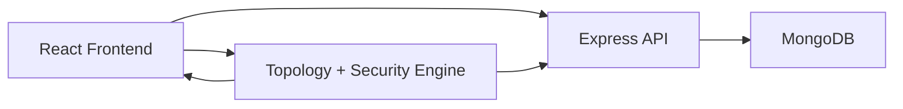

# NETFORGE Presentation Deck (10-12 Slides)

## Template Style

- Theme: dark professional tech deck
- Colors: navy, cyan, white, slate
- Fonts:
  - Heading: Poppins or Montserrat
  - Body: Inter or Calibri

---

## Slide 1: Title

**NETFORGE**  
Intelligent Network Topology Automation Platform

**Subtitle:**  
Topology Generation, Cisco Configuration, Security Analysis, and MongoDB Integration

**Presented by:**  
TEJA SADI

---

## Slide 2: Problem Statement

- Manual network design takes time and effort
- VLAN planning, IP allocation, and routing setup are error-prone
- Security is often checked after design instead of during design
- Many academic tools use static data and do not support real persistence

**Speaker note:**  
The project solves the gap between design, security evaluation, and usable configuration output.

---

## Slide 3: Objectives

- Generate topologies automatically
- Assign VLANs, subnets, gateways, and IP addresses
- Create Cisco-style router and switch configs
- Analyze topology security
- Store users and topologies in MongoDB
- Provide analytics and admin management

---

## Slide 4: Proposed System

- Intelligent topology generator
- Configuration generator
- Security analysis engine
- AI assistant guidance
- Cisco config workspace
- MongoDB-backed authentication and storage

**Speaker note:**  
The platform brings all major networking tasks into one workflow.

---

## Slide 5: System Architecture

**Frontend**
- React
- TypeScript
- Tailwind CSS

**Backend**
- Node.js
- Express.js

**Database**
- MongoDB
- Mongoose

**Suggested diagram:**

---

## Slide 6: Auto Topology and Configuration

**Input**
- routers
- switches
- PCs
- VLANs
- department

**Output**
- structured topology
- core, distribution, access layout
- automatic VLANs and IP plan
- router and switch configuration

**Speaker note:**  
This module reduces manual effort and improves consistency.

---

## Slide 7: Security and Cisco Features

**Security Analysis**
- firewall presence
- segmentation quality
- open connections
- risk score 0 to 100

**Cisco Workspace**
- router config
- switch config
- VLAN config
- verification commands
- hardening commands

---

## Slide 8: MongoDB Integration

**MongoDB Collections**
- `users`
- `topologies`

**Stored in MongoDB**
- login/register users
- profile data
- saved topologies
- security score/status
- topology ownership
- department analytics from topology records

**Speaker note:**  
This makes the project a real full-stack system instead of a local demo app.

---

## Slide 9: Dashboard, Departments, and Admin Panel

- live dashboard statistics
- department analytics from saved topology data
- average security per department
- user management through admin panel
- role control:
  - admin
  - engineer
  - viewer

---

## Slide 10: Demo Flow

1. Log in as admin or register a user
2. Generate a topology
3. Save topology to MongoDB
4. View dashboard and department analytics
5. Check security analysis
6. Open Cisco page and export configs
7. Manage users from admin panel

---

## Slide 11: Results

- reduced manual network planning effort
- improved consistency in configuration generation
- added security checking during topology design
- enabled persistent multi-user management
- produced practical Cisco-ready output

---

## Slide 12: Conclusion and Future Scope

**Conclusion**
- NETFORGE is now an intelligent network automation platform
- It combines design, security, Cisco configuration, analytics, and MongoDB persistence

**Future Scope**
- JWT authentication
- forgot password
- real GNS3 integration
- advanced Cisco protocol templates

**Closing:**  
Thank you

