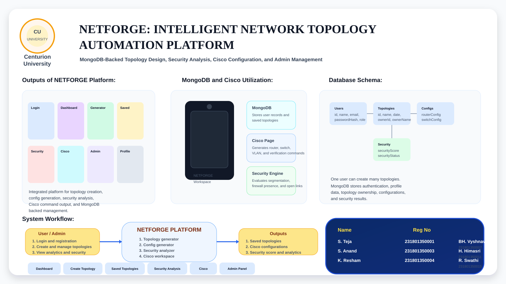
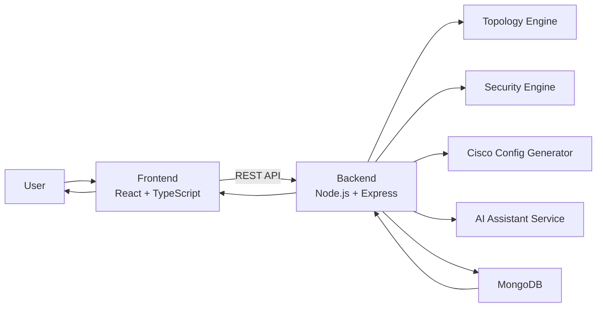
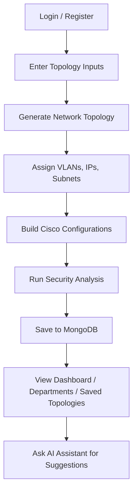
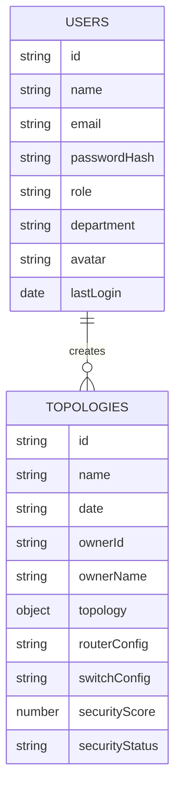

# NETFORGE

[](https://react.dev/)
[](https://nodejs.org/)
[](https://www.mongodb.com/)
[](https://vitejs.dev/)
[](https://platform.openai.com/)
[](#license)

NETFORGE is a full-stack network topology automation platform for designing, analyzing, and managing secure network layouts. It combines automatic topology generation, Cisco-style configuration output, security scoring, MongoDB-backed persistence, role-based user management, and an AI assistant in one web application.

## Quick Navigation

- [Overview](#overview)
- [Core Features](#core-features)
- [System Architecture](#system-architecture)
- [Workflow](#workflow)
- [Main Modules](#main-modules)
- [Database Design](#database-design)
- [Setup](#setup)
- [Demo Flow](#demo-flow)
- [Troubleshooting](#troubleshooting)

## Overview

Modern network planning is often split across multiple tools for topology drawing, IP planning, device configuration, and security review. NETFORGE brings those steps into one workflow:

- create a topology from router, switch, PC, and VLAN counts
- auto-assign IP ranges, subnets, gateways, and VLAN mappings
- generate Cisco-oriented router and switch configs
- analyze security posture and suggest improvements
- save everything in MongoDB for reuse and analytics

## Core Features

- Auto topology generation using routers, switches, PCs, and VLAN count
- Layered design with core, distribution, and access connectivity
- Automatic IP addressing, subnet allocation, and VLAN planning
- Cisco-style router, switch, VLAN, routing, and verification commands
- Security analysis with score, findings, and improvement suggestions
- Dashboard analytics for topologies, devices, departments, and security
- MongoDB-backed authentication, profile management, and topology storage
- Admin panel for role updates, department management, and user control
- AI assistant with OpenAI support and intelligent fallback mode

## System Architecture



## Workflow



## Project Highlights

- Secure topology planning with VLAN-aware network generation
- MongoDB-backed multi-user platform with admin controls
- Cisco configuration workspace for routers and switches
- Security scoring and recommendation engine
- AI assistant with graceful fallback mode for demos and offline usage

## Tech Stack

### Frontend

- React
- TypeScript
- Vite
- Tailwind CSS
- shadcn/ui
- Recharts
- Framer Motion

### Backend

- Node.js
- Express.js

### Database

- MongoDB
- Mongoose

### AI

- OpenAI API
- Built-in fallback assistant when API access is unavailable

## Main Modules

### 1. Authentication and User Management

- user registration and login
- MongoDB-backed profile storage
- role-based access for admin, engineer, and viewer
- admin user creation, role update, department update, and delete flow

### 2. Auto Topology Generator

- topology name and department input
- router, switch, PC, and VLAN count input
- structured network generation with logical device linking
- reusable topology model for config and security modules

### 3. Configuration Generator

- automatic subnet and gateway generation
- VLAN ID assignment
- router and switch configuration output
- Cisco verification command support

### 4. Security Analysis Engine

- detection of missing firewall placement
- detection of weak segmentation
- open connection review
- security score and recommendation output

### 5. Dashboard and Analytics

- total topology count
- device distribution summary
- department-wise topology insights
- security score trend and status overview

### 6. AI Assistant

- topology-aware questions and answers
- OpenAI-backed response generation
- fallback assistant for offline or quota-limited scenarios
- suggestions for VLAN design, firewall placement, and security posture

## Project Structure

```text
CODEX/
|-- backend/
|   |-- config/
|   |-- models/
|   |-- services/
|   `-- server.js
|-- public/
|-- src/
|   |-- components/
|   |-- contexts/
|   |-- lib/
|   |-- pages/
|   |-- test/
|   |-- types/
|   `-- utils/
|-- .vscode/
|-- .env.example
|-- package.json
`-- README.md
```

## Database Design

### Collections

#### `users`

- `id`
- `name`
- `email`
- `passwordHash`
- `role`
- `department`
- `avatar`
- `lastLogin`

#### `topologies`

- `id`
- `name`
- `date`
- `ownerId`
- `ownerName`
- `topology`
- `routerConfig`
- `switchConfig`
- `securityScore`
- `securityStatus`

### Relationship

- one user can create many topologies

## Database Schema Diagram



## Screens and Pages

- `Dashboard` - analytics and summary
- `Create Topology` - generate and save topologies
- `Saved Topologies` - view and manage topology records
- `Departments` - department analytics derived from MongoDB
- `Security Analysis` - topology security evaluation
- `Cisco` - Cisco IOS-style configuration workspace
- `Profile` - MongoDB-backed user profile management
- `Admin Panel` - user and role management for admins

## Setup

### Requirements

- Node.js
- npm
- MongoDB Community Server
- MongoDB Compass or Mongo Shell

### Installation

```sh
npm install
```

### Environment Variables

Create a `.env` file in the project root using `.env.example`.

Example:

```env
MONGODB_URI=mongodb://127.0.0.1:27017/netforge
PORT=5000
VITE_API_BASE_URL=http://127.0.0.1:5000/api
OPENAI_API_KEY=
OPENAI_MODEL=gpt-5-mini
```

## Running the Project

### Start Backend

```sh
npm run dev:server
```

Backend:

```text
http://127.0.0.1:5000
```

Health check:

```text
http://127.0.0.1:5000/api/health
```

### Start Frontend

```sh
npm run dev
```

Frontend usually runs on:

```text
http://127.0.0.1:8080
```

### Start Full Stack

```sh
npm run dev:full
```

## Demo Flow

1. Log in with an admin or engineer account.
2. Open `Create Topology`.
3. Enter routers, switches, PCs, VLANs, and department.
4. Generate and save the topology.
5. Open `Security Analysis` to view score and recommendations.
6. Open `Cisco` to inspect configuration output.
7. Open `Dashboard` and `Departments` to review analytics.
8. Ask the AI assistant topology-specific questions.

## Demo Accounts

The backend seeds default users on startup.

- Admin: `admin@netforge.io` / `admin123`
- Engineer: `engineer@netforge.io` / `eng123`
- Viewer: `viewer@netforge.io` / `view123`

## Scripts

```sh
npm run dev
npm run dev:client
npm run dev:server
npm run dev:full
npm run build
npm run lint
npm run test
```

## Current Scope

### Implemented

- MongoDB-backed authentication
- MongoDB-backed topology storage
- topology ownership tracking
- dashboard and department analytics
- Cisco configuration workspace
- admin user management
- AI assistant integration with fallback mode

### Planned / Future Work

- forgot password flow
- delete account flow
- JWT-based auth/session handling
- real GNS3 integration
- deeper Cisco protocol templates
- richer security scan history

## Real-World Applications

- enterprise network planning
- academic networking labs
- Cisco configuration practice
- topology validation before deployment
- security-aware network design
- department-level infrastructure planning

## Troubleshooting

- Restart the backend after backend code changes so new API routes are loaded.
- Restart the frontend after changing Vite environment variables.
- If the frontend shows fetch errors, verify that the backend is reachable at `/api/health`.
- If OpenAI quota is unavailable, the assistant will automatically switch to built-in fallback mode.

## License

This project is currently intended for academic and demonstration use.
